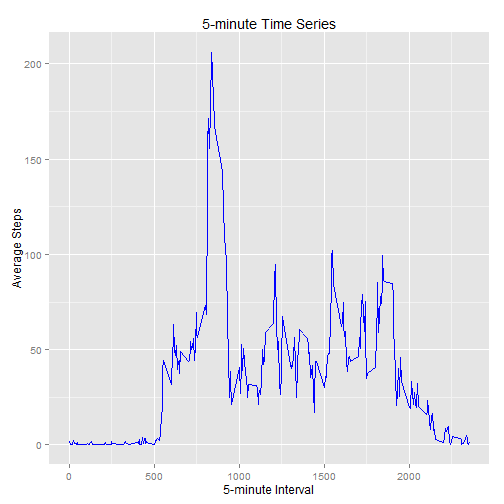
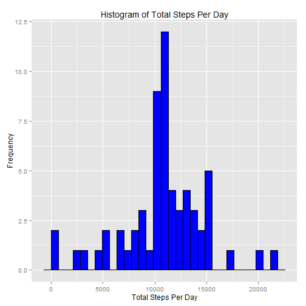

echo = TRUE # Make the code visible

```r
library(dplyr)
```

```
## 
## Attaching package: 'dplyr'
## 
## The following objects are masked from 'package:stats':
## 
##     filter, lag
## 
## The following objects are masked from 'package:base':
## 
##     intersect, setdiff, setequal, union
```

```r
library(ggplot2)
```

##Loading and preprocessing the data


```r
unzip("activity.zip",exdir="activity")
data <- read.csv("activity/activity.csv", header = TRUE, colClasses = c("integer", "Date", "integer"))
datan <- na.omit(data)
head(datan)
```

```
##     steps       date interval
## 289     0 2012-10-02        0
## 290     0 2012-10-02        5
## 291     0 2012-10-02       10
## 292     0 2012-10-02       15
## 293     0 2012-10-02       20
## 294     0 2012-10-02       25
```

##What is mean total number of steps taken per day?

1.Calculate the total number of steps taken per day

```r
data1 <- group_by(datan, date)
tsteps <- summarize(data1, totalsteps = sum(steps))
head(tsteps)
```

```
## Source: local data frame [6 x 2]
## 
##         date totalsteps
## 1 2012-10-02        126
## 2 2012-10-03      11352
## 3 2012-10-04      12116
## 4 2012-10-05      13294
## 5 2012-10-06      15420
## 6 2012-10-07      11015
```


2.Make a histogram of the total number of steps taken each day.

```r
ggplot(data=tsteps, aes(x=totalsteps)) + geom_histogram(fill="blue", color="black") + labs(x="Steps Per Day", y="Frequency") + ggtitle("Histogram of Steps Per Day")
```

```
## stat_bin: binwidth defaulted to range/30. Use 'binwidth = x' to adjust this.
```

 


3.Calculate and report the mean and median of the total number of steps taken per day

mean of the total number of steps taken per day:

```r
oldmean <- mean(tsteps$totalsteps)
oldmean
```

```
## [1] 10766.19
```

median of the total number of steps taken per day:

```r
oldmedian <- median(tsteps$totalsteps)
oldmedian
```

```
## [1] 10765
```

##What is the average daily activity pattern?

1.Make a time series plot (i.e. type = "l") of the 5-minute interval (x-axis) and the average number of steps taken, averaged across all days (y-axis)


```r
data11 <- group_by(datan, interval)
tseries <- summarize(data11, steps = mean(steps))
ggplot(data=tseries, aes(x=interval, y=steps)) + geom_line(color="blue") + labs(x="5-minute Interval", y="Average Steps") +ggtitle("5-minute Time Series")
```

 

2.Which 5-minute interval, on average across all the days in the dataset, contains the maximum number of steps?

```r
tseries[which(tseries$steps == max(tseries$steps)),]
```

```
## Source: local data frame [1 x 2]
## 
##   interval    steps
## 1      835 206.1698
```

##Imputing missing values

1.Calculate and report the total number of missing values in the dataset (i.e. the total number of rows with NAs)

```r
sum(is.na(data))
```

```
## [1] 2304
```

2.Devise a strategy for filling in all of the missing values in the dataset. 

I use the mean for that 5-minute interval for the missing values.

3.Create a new dataset that is equal to the original dataset but with the missing data filled in.

```r
newdata <- data
for (i in 1:nrow(newdata)) {
      if (is.na(newdata$steps[i])) {
            newdata$steps[i] <- tseries[which(tseries$interval== newdata$interval[i]),]$steps
      }
}
head(newdata)
```

```
##       steps       date interval
## 1 1.7169811 2012-10-01        0
## 2 0.3396226 2012-10-01        5
## 3 0.1320755 2012-10-01       10
## 4 0.1509434 2012-10-01       15
## 5 0.0754717 2012-10-01       20
## 6 2.0943396 2012-10-01       25
```

4.Make a histogram of the total number of steps taken each day and Calculate and report the mean and median total number of steps taken per day. Do these values differ from the estimates from the first part of the assignment? What is the impact of imputing missing data on the estimates of the total daily number of steps?


```r
data22 <- group_by(newdata, date)
ntsteps <- summarize(data22, totalsteps = sum(steps))
ggplot(data=ntsteps, aes(x=totalsteps)) + geom_histogram(fill="blue", color="black") + labs(x="Total Steps Per Day", y="Frequency") + ggtitle("Histogram of Total Steps Per Day")
```

```
## stat_bin: binwidth defaulted to range/30. Use 'binwidth = x' to adjust this.
```

 

Mean of the total number steps taken per day:

```r
newmean <- mean(ntsteps$totalsteps)
newmean
```

```
## [1] 10766.19
```

Median of the total number steps taken per day:

```r
newmedian <- median(ntsteps$totalsteps)
newmedian
```

```
## [1] 10766.19
```
Difference of two means:

```r
dmean <- newmean -oldmean
dmean
```

```
## [1] 0
```
Difference of two medians:

```r
dmedian <- newmedian - oldmedian
dmedian
```

```
## [1] 1.188679
```

So, after imputing the missing data, the mean is still the same; the new median of total steps taken per day is greater than that of the old median.

##Are there differences in activity patterns between weekdays and weekends?

1.Create a new factor variable in the dataset with two levels - "weekday" and "weekend" indicating whether a given date is a weekday or weekend day.


```r
newdata$datatype <- ifelse(weekdays(newdata$date) %in% c("Saturday", "Sunday"), "weekend", "weekday")
head(newdata)
```

```
##       steps       date interval datatype
## 1 1.7169811 2012-10-01        0  weekday
## 2 0.3396226 2012-10-01        5  weekday
## 3 0.1320755 2012-10-01       10  weekday
## 4 0.1509434 2012-10-01       15  weekday
## 5 0.0754717 2012-10-01       20  weekday
## 6 2.0943396 2012-10-01       25  weekday
```


2.Make a panel plot containing a time series plot (i.e. type = "l") of the 5-minute interval (x-axis) and the average number of steps taken, averaged across all weekday days or weekend days (y-axis). 


```r
data33 <- group_by(newdata, interval, datatype)
ntimeseries <- summarize(data33, steps = mean(steps))
ggplot(data=ntimeseries, aes(x=interval, y=steps)) + geom_line(color="blue") + labs(x="5-minute Interval", y="Average Steps") + ggtitle("5-minute Time Series") + facet_grid(datatype~.)
```

 


